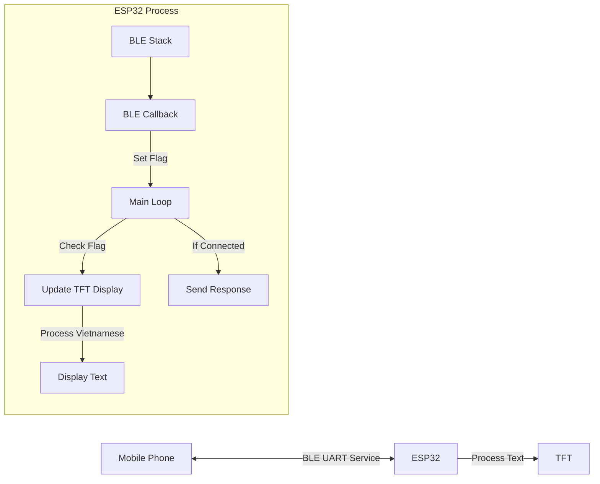

# ESP32 BLE Display Project (HelloTransport)

A project for ESP32 that creates a Bluetooth Low Energy (BLE) server to display messages received from a mobile device on a TFT display, with special handling for Vietnamese characters.


## 📑 Table of Contents

- [Overview](#overview)
- [Hardware Requirements](#hardware-requirements)
- [Features](#features)
- [Vietnamese Text Support](#vietnamese-text-support)
- [Data Flow](#data-flow)
- [Project Structure](#project-structure)
- [Setup and Installation](#setup-and-installation)
- [Usage](#usage)
- [BLE Communication](#ble-communication)

## 📌 Overview

This project creates an ESP32-based Bluetooth Low Energy (BLE) device that functions as a display terminal. It receives messages from a connected device (like a smartphone) and displays them on a TFT display. The project includes special handling for Vietnamese characters.

## 🔧 Hardware Requirements

- **Microcontroller**: ESP32 development board
- **Display**: TFT display compatible with TFT_eSPI library
- **Power Supply**: USB or battery power for ESP32

### Technical Specifications

| Component | Specification |
|-----------|---------------|
| Microcontroller | ESP32 (Dual-core, 240MHz, Wi-Fi + Bluetooth) |
| Connectivity | Bluetooth Low Energy (BLE) |
| Display | TFT display (compatible with TFT_eSPI library) |
| Flash Memory | Depends on ESP32 model (typically 4MB) |
| RAM | Depends on ESP32 model (typically 520KB) |

## ✨ Features

- BLE server that advertises using standard UART service UUID
- Connected/disconnected status display
- Received message display
- Special handling for Vietnamese characters (with diacritics)
- Two display methods for Vietnamese text:
  1. Display with underlines to indicate diacritical marks
  2. Convert to non-accent Vietnamese text for simpler display
- Automatic response to received messages
- Thread-safe display updates

## 🇻🇳 Vietnamese Text Support

The project implements two methods for displaying Vietnamese text:

1. **Method 1**: Displays the base character with a red underline to indicate diacritical marks
2. **Method 2**: Converts Vietnamese text with diacritics to non-accent Vietnamese text

The system includes an extensive mapping of Vietnamese characters with diacritics to their base equivalents. This allows for displaying Vietnamese text even on displays that don't support UTF-8 rendering.

### Vietnamese Character Processing

```
Input UTF-8 Vietnamese text → Character mapping → Display method selection → Rendering
```

## 📊 Data Flow



### Communication Flow

1. Mobile device connects to ESP32 via BLE
2. ESP32 displays connection status
3. Mobile device sends text message (potentially with Vietnamese characters)
4. BLE callback receives message and sets flag for processing
5. Main loop detects flag and processes text
6. Display is updated with received text using Vietnamese character handling
7. ESP32 sends confirmation message back to mobile device
8. Process repeats for new messages

## 📁 Project Structure

```
HelloTransport/
├── src/
│   ├── main.cpp           # Main application code
│   ├── BLEHUDNaviESP32.ino # Arduino-style code
│   ├── DataConstants.h    # Constants definitions
│   ├── ImagesDirections.h # Direction images
│   ├── ImagesLanes.h      # Lane images
│   ├── ImagesOther.h      # Other images
│   └── VoltageMeasurement.h # Voltage measurement functionality
├── include/
│   └── sdkconfig.h        # ESP32 SDK configuration
├── lib/                   # External libraries
├── platformio.ini         # PlatformIO configuration
└── partitions.csv         # ESP32 partition table
```

## 🚀 Setup and Installation

1. Clone this repository
2. Open the project in PlatformIO
3. Configure your TFT display settings in the TFT_eSPI library configuration
4. Build and upload to your ESP32 device

```bash
# Using PlatformIO CLI
platformio run --target upload
```

## 📱 Usage

1. Power on the ESP32 device
2. Connect to "ESP32_BT_Display" from your mobile device using a BLE UART app
3. Send text messages (with or without Vietnamese characters)
4. The display will show your messages and send a confirmation

## 🔄 BLE Communication

### Service and Characteristics

The project uses standard BLE UART service for communication:

- **Service UUID**: `6E400001-B5A3-F393-E0A9-E50E24DCCA9E`
- **RX Characteristic UUID** (for receiving data from phone): `6E400002-B5A3-F393-E0A9-E50E24DCCA9E`
- **TX Characteristic UUID** (for sending data to phone): `6E400003-B5A3-F393-E0A9-E50E24DCCA9E`

### Data Format

The BLE communication uses UTF-8 encoding to support Vietnamese characters. When sending Vietnamese text from a mobile app, ensure proper UTF-8 encoding.

## 📄 License

[MIT License](LICENSE)

---

Project developed by Hiep © 2023-2025
